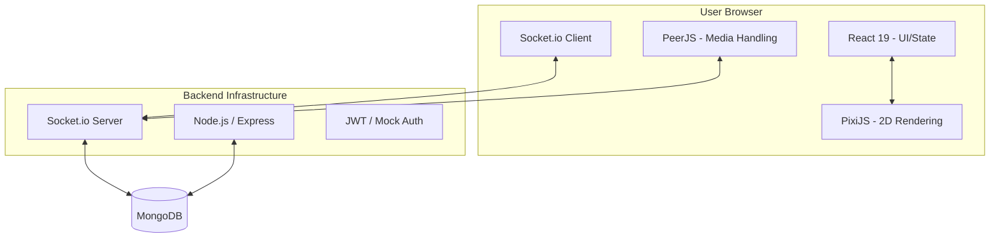

# 🏗️ Cosmos Tutedusko: System Design Document

This document provides a detailed breakdown of the internal architecture, data flow, and technology choices behind the Cosmos Tutedusko platform.

---

## 1. High-Level Architecture Overview

Cosmos Tutedusko is a **Real-time Distributed Interactive Space**. It combines a 2D spatial canvas with a professional productivity dashboard.

---

## 2. Core Subsystems

### 📍 A. Spatial Engine (PIXI.js)
The 2D engine handles tiling, avatar rendering, and coordinate tracking.
- **Tick-based updates**: Position `(x, y)` is updated locally for immediate feedback (60fps) and throttled when emitted to the server.
- **Coordinates Syncing**: Server receives position updates and broadcasts to all other connected clients in the same space.

### 🌐 B. Real-time Communication (Socket.IO)
Handles the "Signaling" and state synchronization.
- **Chat Modules**: Persistent room-based chat and global channels.
- **Proximity Logic**: Server calculates distances to determine which messages should be "heard" by which users. Current Proximity Radius: `150px`.

### 📹 C. Media Layer (WebRTC - PeerJS)
Provides Peer-to-Peer (P2P) audio and video streaming.
- **Signaling**: Sockets notify users of incoming calls or nearby presence.
- **Streaming**: Once coordinates match the proximity threshold, PeerJS initiates a direct connection between browsers to exchange MediaStreams.
- **Optimization**: Server is never burdened with video/audio data, ensuring high scalability.

### 🗄️ D. Database Layer (MongoDB)
- **Persistence**: Messages, User Profiles, and Room states are stored permanently.
- **Schema**: Mongoose models handle strict data types for consistent message formatting.

---

## 3. Data Flow

1. **Join Flow**: User enters name -> Server creates entry -> Broadcasts 'user-joined' -> MongoDB persists log.
2. **Move Flow**: Input -> Pixi update -> Socket Emit -> Socket Broadcast -> Remote Pixi update.
3. **Chat Flow**: Input -> Proximity check -> Socket Emit -> Server Filter -> Targeted Broadcast to nearby peers.

---

## 4. UI Design Philosophy (Glassmorphism)
- **Transparency**: Heavy use of `backdrop-filter: blur(20px)` and semi-opaque backgrounds.
- **Hierarchy**: Z-index management ensures that the 2D canvas stays as a background while professional sidebar and dashboard overlays interact with the user's focus.

---

> This system design is intended to handle high concurrency with minimal server overhead. 🌌
